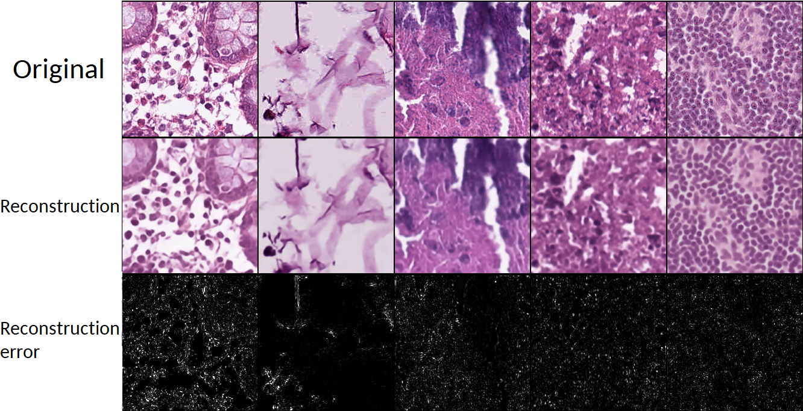
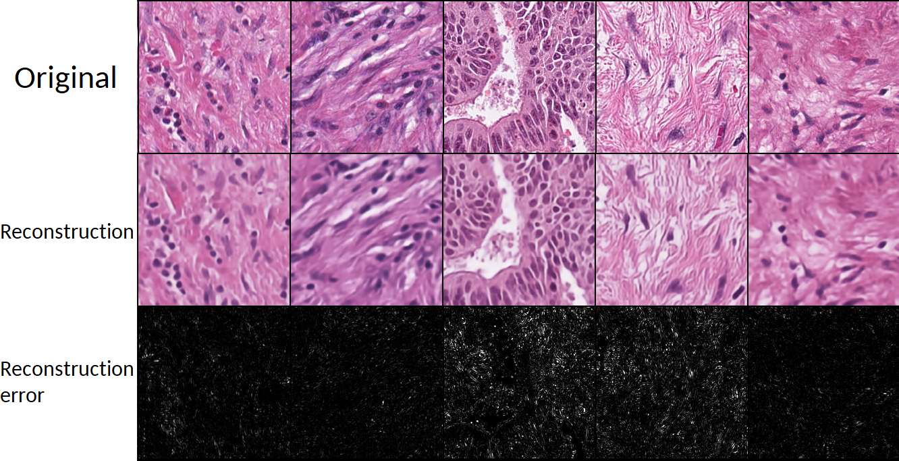

# Cancer Histopathology Anomaly Detection: CNN on unsupervised VQ-VAE Reconstruction

In this repository, I will be performing classification of the presence of cancer on histopathological slides through anomaly detection. This will be achieved by first training a VIT VQ-VAE on healthy tissue in an unsupervised manner. The assumption here is that the VQ-VAE will learn how to reconstruct healthy tissue, but will struggle with never-before-seen samples of cancerous cells. See my other projects for the source of my self-implemented VIT VQ-VAE that i use in this project

The reconstruction error will thus be a proxy of how much a sample looks like the distribution that the VQ-VAE was trained on, which was only healthy tissue. This reconstruction error could be directly taken as the likelihood that a sample is cancerous, but a better approach is to use the pixel-wise reconstruction error to train a new CNN in a supervised way.

*Note: for the amount of channels I'm assuming an input image with a single channel*

## Reconstruction

*Animation of validation reconstruction after each training epoch on the celebA-HQ 256x256 dataset. Using VIT encoder and decoder, and latent resolution of 32x32*

I am not particularly happy with the current version of the trained vq-vae for recontstruction. Training was unstable, and total loss would often stagnate or regress for tens of epochs while the actual reconstruction loss (MSE) would continue to improve. I suspect the codebook size was too big (512) for the relative simple images. Plus ive now realize the current latent space is too small for this use case, too much detail is lost, and a more standard latent size of 64x64 would probably work better for the intended use case.

## Reconstruction errors
### Non-Cancerous Cells

### Cancerous Cells

I think, currently, too much of the reconstruction error is due to poor reconstruciton where too much detail is lost. This results in an error that effectively masks the error that occurs due to (parts of) the input image (cancerous) being out of the distrubution it was trained on (non-cancerous).

## Results: Experiment
For a comparison, I've trained models using the ResNet18 architecture. Training was performed on 10k images that were not used during the training of the reconstruction-model. Validation was performed on another held-out 10k images. A comparison was made between only using the image as input, and using both the image, and the pixel-wise reconstruction as input.

While the dataset initially contains 9 different classes, for the sake of this experiment they were group under Cancerous (1) or Non-Cancerous.A weighted loss function was used to compensate for the imbalance in the dataset. Which is approximately 2 cancerous slides for every 7 non-cancerous slides.

Averaging over the entire training dataset, which the VQ VAE has never seen, the average MSE reconstruction error for non-cancerous images is 0.036, while the average for cancerous images is 0.054. This is a positive result, indicating that the reconstruction error for cells outside of the distribution of healthy cells will be higher, confirming our initial theory.

### CNN: image only
- Accuracy: 0.9182817339897156
- Precision: 0.8078078031539917
- Recall: 0.8755085468292236
- F1 Score: 0.840296745300293

## Results: Experiment 2 (improved)

## Next Steps
As a next step, I need to improve the quality of the reconstructions. One of the the most important parts of this is increacing the latent resolution from 32x32 to 64x64, which should allow for more details to be modelled. Also experiment with smaller codebook sizes.
